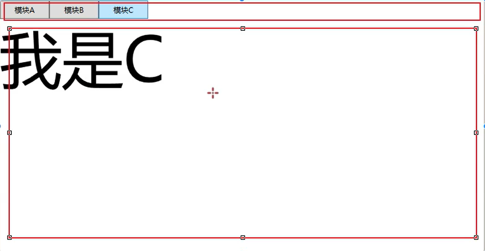
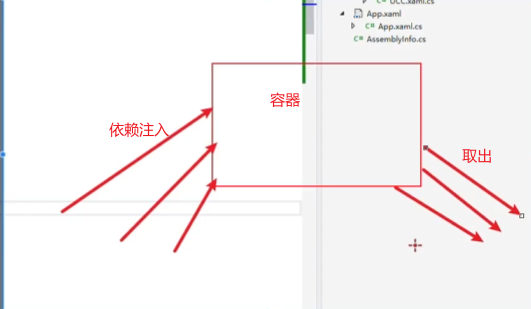
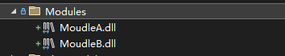
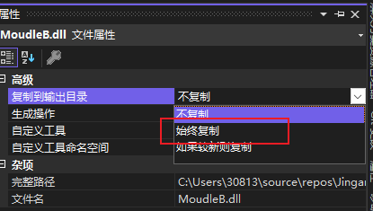
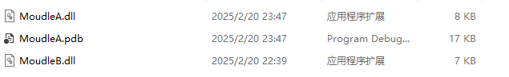

# Prism

官网：[Prism 简介 |棱镜](https://docs.prismlibrary.com/docs/)

官网的学习视频：[Prism 学习视频](https://prismlibrary.com/#learn)

博客园：[Prism开发人员指南5-WPF开发 文档翻译（纯汉语版） - o0o秋叶o0o - 博客园](https://www.cnblogs.com/DoubleChen/p/3680334.html)

## 快速开始

### [Getting Started | Prism](https://docs.prismlibrary.com/docs/platforms/wpf/getting-started.html)

Prism 入门非常简单。请按照以下步骤操作，您将快速启动并运行一个模块化且易于维护的应用程序。

> 本指南假定您对 WPF 应用程序项目的结构有一定的了解，并且对 C# 有一定的了解。了解 Model-View-ViewModel （MVVM） 模式很有帮助，而且 WPF 很容易支持该模式。如果你不是，请考虑先花点时间对它进行一些研究。

### 安装 Nuget 包

在 Visual Studio 中创建全新的 WPF 应用程序。接下来是安装相应的 nuget 包。此时，需要做出选择，即使用哪个容器来管理依赖项。就本文档而言，Unity 将是首选容器。请参阅下面的可用列表。

| 包           | 容器                                             | 版本   |
| :----------- | :----------------------------------------------- | :----- |
| Prism.Unity  | [Unity](https://github.com/unitycontainer/unity) | 5.11.1 |
| Prism.DryIoc | [DryIoc](https://github.com/dadhi/DryIoc)        | 4.0.7  |

> 注意：无需显式安装任何其他依赖项。安装上述软件包之一还将负责安装容器的软件包以及共享的 Prism 软件包。


## 各版本之间的区别


### 覆盖现有应用程序对象

入门的下一步是将新创建的 WPF 项目中包含的 Application 对象子类化。导航到 ，并将标准 WPF Application 类替换为 Prism 类。`App.xaml``PrismApplication`

```xml
<prism:PrismApplication
    x:Class="WpfApp1.App"
    xmlns="http://schemas.microsoft.com/winfx/2006/xaml/presentation"
    xmlns:x="http://schemas.microsoft.com/winfx/2006/xaml"
    xmlns:local="clr-namespace:WpfApp1"
    xmlns:prism="http://prismlibrary.com/">
    <Application.Resources>
    </Application.Resources>
</prism:PrismApplication>
```

在上面的代码段中，请注意，已添加第 6 行以定义命名空间，并且 App 对象已更新为派生自 .接下来，导航到代码隐藏文件并更新类定义。`PrismApplication``app.xaml.cs`

> 不要忘记从标签中删除该属性。否则，您最终将得到两个 window 实例。`StartupUri``PrismApplication`

```cs
using System;
using System.Collections.Generic;
using System.Configuration;
using System.Data;
using System.Linq;
using System.Threading.Tasks;
using System.Windows;
using Prism.Unity;

namespace WpfApp1
{
    public partial class App : PrismApplication
    {
    }
}
```

其中定义了一对抽象方法，必须首先实现：RegisterTypes 和 CreateShell。`PrismApplication`

#### 寄存器类型

此函数用于注册任何应用程序依赖项。例如，可能有一个接口用于从某种类型的持久存储中读取客户数据，其实现是使用某种类型的数据库。它可能看起来像这样：

```cs
public interface ICustomerStore
{
    List<string> GetAll();
}

public class DbCustomerStore : ICustomerStore
{
    public List<string> GetAll()
    {
        // return list from db
    }
}
```

应用程序中依赖于客户数据的对象（例如视图模型）将需要一个对象。在该函数中，将进行注册以在每次对象依赖 .`ICustomerStore``App.RegisterTypes``DbCustomerStore``ICustomerStore`

```cs
protected override void RegisterTypes(IContainerRegistry containerRegistry)
{
    containerRegistry.Register<Services.ICustomerStore, Services.DbCustomerStore>();
    // register other needed services here
}
```

> IContainerRegistry has other functions for registering against interfaces as well. will register a created instance of an object against an interface. In effect the implementation of the registered interface is a singleton. A similar method is that will create a single instance at the time the dependency is made and not before. It should be noted that the can also resolve concrete types without a prior registration.`RegisterInstance``RegisterSingleton``Container`

#### CreateShell

必须实现的第二种方法是 CreateShell 方法。这是将创建应用程序主窗口的方法。应该使用 App 类的 Container 属性来创建窗口，因为它会处理任何依赖项。

```cs
public partial class App : PrismApplication
{
    // RegisterTypes function is here

    protected override Window CreateShell()
    {
        var w = Container.Resolve<MainWindow>();
        return w;
    }
}
```

此时，可以构建和运行应用程序，并且应如下所示：


这现在是一个 Prism 应用程序。目前还不多，但 Prism 可以帮忙做很多事情，比如将应用程序分解成可管理的块、导航和实现 MVVM 模式。

### View 模型

WPF 可以很好地使用 MVVM 模式，而 Prism 对此有很大帮助。它有一个基类，用于处理将更改从视图模型发布到视图的 INotifyPropertyChanged 基础结构。还有一些其他类可以简化从视图模型中处理按钮的过程，而不是在代码隐藏中编写事件处理程序。

首先，需要向视图中添加一些控件。转到并添加以下标记作为 .`MainWindow.xaml``<Grid>``<MainWindow>`

```xml
<Grid>
  <Grid.RowDefinitions>
    <RowDefinition Height="*" />
    <RowDefinition Height="Auto" />
  </Grid.RowDefinitions>

  <ListView
            ItemsSource="{Binding Customers}"
            SelectedItem="{Binding SelectedCustomer}"
            />
  <Button
          Grid.Row="1" Width="80" Height="40"
          Command="{Binding CommandLoad}"
          Content="LOAD"
          />
</Grid>
```

上面将添加一个新的 listview，该视图将显示客户名称列表和用于加载列表的按钮。

> 要记住的重要一点是，每次存在 时，都会有一个指向此视图的视图模型的链接。`Binding`

为了帮助完成 Getting Started Guide 的这一部分，需要在项目中设置上面显示的服务。在项目的根目录中，创建一个文件夹。在该文件夹中，创建文件并添加以下代码：`Services``CustomerStore.cs`

```cs
public interface ICustomerStore
{
  List<string> GetAll();
}

public class DbCustomerStore : ICustomerStore
{
  public List<string> GetAll()
  {
    return new List<string>()
    {
      "cust 1",
      "cust 2",
      "cust 3",
    };
  }
}
```

在文件中，确保 包含以下行：`App.xaml.cs``RegisterTypes`

```cs
containerRegistry.Register<Services.ICustomerStore, Services.DbCustomerStore>();
```

### 创建视图模型

首先，在项目的根级别，创建一个名为 .请使用该确切名称，因为稍后在讨论视图模型解析时将需要该名称。`ViewModels`


在该文件夹内，将创建一个名为 .使用该确切名称的原因将在后面显示。Prism 有一个名为 class 的类，它用作所有视图模型的基础，并将从它派生为子类。`ViewModels``MainWindowViewModel``BindableBase``MainWindowViewModel`

```cs
using Prism.Commands;
using Prism.Mvvm;
using System;
using System.Collections.Generic;
using System.Collections.ObjectModel;
using System.Diagnostics;
using System.Linq;
using System.Text;
using System.Threading.Tasks;

namespace WpfApp1.ViewModels
{
    public class MainWindowViewModel : BindableBase
    {
        private Services.ICustomerStore _customerStore = null;

        public MainWindowViewModel(Services.ICustomerStore customerStore)
        {
            _customerStore = customerStore;
        }


        public ObservableCollection<string> Customers { get; private set; } =
            new ObservableCollection<string>();


        private string _selectedCustomer = null;
        public string SelectedCustomer
        {
            get => _selectedCustomer;
            set
            {
                if (SetProperty<string>(ref _selectedCustomer, value))
                {
                    Debug.WriteLine(_selectedCustomer ?? "no customer selected");
                }
            }
        }

        private DelegateCommand _commandLoad = null;
        public DelegateCommand CommandLoad =>
            _commandLoad ?? (_commandLoad = new DelegateCommand(CommandLoadExecute));

        private void CommandLoadExecute()
        {
            Customers.Clear();
            List<string> list = _customerStore.GetAll();
            foreach (string item in list)
                Customers.Add(item);
        }
    }
}
```

对这里发生的事情做一些解释。MainWindowViewModel 对接口具有依赖项，因此该接口必须在 中注册，以便其实现可以由依赖项容器处理。有一个属性绑定到用户界面中的 listview，还有一个属性绑定到列表视图中的当前选定项。

ICustomerStore  App.RegisterTypes  Customers  SelectedCustomer

还有实现接口的 CommandLoad 对象。这有一个方法，当用户单击按钮时调用该方法。Prism 使用允许传入委托以处理接口实现的类实现接口。在 的情况下，该函数作为委托传入，现在，每当 WPF 绑定系统尝试执行 时，都会调用 。`ICommand``Execute``ICommand``DelegateCommand``ICommand``CommandLoad``CommandLoadExecute``ICommand.Execute``CommandLoadExecute`

有关 DelegateCommand 的更多详细信息，请参阅[命令](https://docs.prismlibrary.com/docs/commands/commanding.html)。

#### 使用 ViewModelLocator

**这一段的翻译感觉有点小问题，建议看一下英文原文。**现在有了一个 View 和一个 ViewModel，但它们是如何链接在一起的呢？开箱即用的 Prism 有一个 that 使用约定来确定视图模型的正确类，使用其依赖项实例化它，并将其附加到视图。`ViewModelLocator``DataContext`

默认约定是将所有视图放置在文件夹中，并将视图模型放置在文件夹中。`Views``ViewModels`

- `WpfApp1.Views.MainWindow` => `WpfApp1.ViewModels.MainWindowViewModel`
- `WpfApp1.Views.OtherView` => `WpfApp1.ViewModels.OtherViewModel`

这是可配置的，并且可以添加不同的分辨率逻辑。

为此，View 和 ViewModel 必须正确地位于其正确的命名空间中。下面是一个屏幕截图：


[单击此处了解有关](https://docs.prismlibrary.com/docs/mvvm/viewmodel-locator.html) .`ViewModelLocator`

如果您出于某种原因不想使用此功能，则必须在视图中选择退出。您可以在 XAML 中对此进行管理，如下所示：

```xml
<Window
    ...
    xmlns:prism="http://prismlibrary.com/"
    prism:ViewModelLocator.AutoWireViewModel="False"
    >

    <!-- ui controls here -->
</Window>
```

# 龙马哥的项目实战

项目git地址：https://github.com/Jingan567/WPF_Prism_WebAPi_LongMa.git

视频地址：[【上位机系列第二阶段 WPF项目实战】WPF+prism+WebApi应用实战](https://www.bilibili.com/video/BV1sz42197wz/?p=2&share_source=copy_web&vd_source=1faf6f8be863497a8aa161f8493e14d2) 

Prism 框架提供了一套丰富的工具、类和模块，帮助开发人员实现以下功能：

1. **模块化**：Prism 框架支持将应用程序拆分为多个模块，每个模块具有自己的功能和视图。这种模块化的设计使得应用程序更加灵活和可扩展。
2. **导航**：Prism 框架提供了导航功能，可以方便地在不同的视图之间进行导航和交互。开发人员可以定义导航路径和参数，以及处理导航事件。
3. **依赖注入**：Prism 框架内置了一个轻量级的依赖注入容器，可以帮助开发人员管理和解决组件之间的依赖关系。这样可以提高代码的可测试性和可维护性。
4. **事件聚合器**：Prism 框架提供了一个事件聚合器，可以帮助不同模块之间进行解耦和通信。开发人员可以通过发布和订阅事件来实现模块之间的交互。
5. **命令绑定**：Prism 框架支持命令绑定，可以将用户操作和后台逻辑进行绑定。这样可以更好地分离用户界面和业务逻辑。
6. **可测试性**：Prism 框架的设计考虑了应用程序的可测试性，提供了一些工具和模式，帮助开发人员编写可测试的代码。

## 快速创建Wpf框架的项目

安装扩展


## **区域**




### 绑定基础

BindableBase 这是Prism中用于绑定的类，BindableBase 实现 INotifyPropertyChanged

INotifyPropertyChanged 是WPF用于绑定的接口

### 查找数据上下文

**如果文件夹是正确的，Prism可以自己找到上下文**。**通过设置prism:ViewModelLocator.AutoWireViewModel="True"，这是附加属性默认是True，可以不配置。Prism会根据命名空间去找，找到就万事大吉，找不到就GG。**不止对ViewModel的命名空间有要求，View的命名空间也有要求。

```xaml
prism:ViewModelLocator.AutoWireViewModel="True"
```

```xaml
<Window x:Class="WpfForPrism.MainWindow"
        xmlns="http://schemas.microsoft.com/winfx/2006/xaml/presentation"
        xmlns:x="http://schemas.microsoft.com/winfx/2006/xaml"
        xmlns:d="http://schemas.microsoft.com/expression/blend/2008"
        xmlns:mc="http://schemas.openxmlformats.org/markup-compatibility/2006"
        xmlns:local="clr-namespace:WpfForPrism"
        xmlns:prism="http://prismlibrary.com/" 
        prism:ViewModelLocator.AutoWireViewModel="True"
        mc:Ignorable="d"
        Title="MainWindow" Height="450" Width="800">
```

**如果不想使用Prism的自动配置**

```C#
 /// <summary>
 /// 注入服务，需要什么服务就注入什么服务。
 /// </summary>
 /// <param name="containerRegistry"></param>
 protected override void RegisterTypes(IContainerRegistry containerRegistry)
 {
     containerRegistry.RegisterForNavigation<UCC,UCBViewModel>();
 }
```


#### WPF中的手动配置

d:DataContext="{d:DesignInstance Type=viewmodels:MainWindow1ViewModel}" 这行代码仅用于设计时数据上下文设置，不会在运行时生效。

```xaml
 d:DataContext="{d:DesignInstance Type=viewmodels:MainWindow1ViewModel}"
```

这样写就可以让配置在运行时也生效

```xaml
<Window d:DataContext="{d:DesignInstance Type=viewmodels:MainWindow1ViewModel}"
        DataContext="{Binding Source={x:Static viewmodels:MainWindow1ViewModel}}">
  <Window.Resources>
    <viewmodels:MainWindow1ViewModel x:Key="MainWindow1ViewModel"/>
  </Window.Resources>
</Window>
```

### 依赖注入



将需要的类型注入到容器中，需要使用的时候使用

```C#
_regionManager.Regions["contentRegion"].RequestNavigate(viewName);
```

### 设置区域名称

```xaml
 <ContentControl Grid.Row="1" prism:RegionManager.RegionName="contentRegion" />
 <!-- prism:RegionManager.RegionName="contentRegion" 指定一个区域的名称-->
```

```C#
protected override void RegisterTypes(IContainerRegistry containerRegistry)
{
    containerRegistry.RegisterForNavigation<UCC>("C");//C是指定的名称
}
```


## 模块化

**我要引用的模块不在我这个项目里面，在其他的项目里面。**我不想引用，因为引用需要生成。模块化就是要实现这个功能

**去除引用，新建Modules文件夹，将模块.dll放入其中。**



将dll选择始终复制，生成操作还是无



Debug的目录下就多了一个Modules文件夹，这样应该可以直接将写好的模块直接丢到这个文件夹中。**这个dll只用在使用的时候才去加载。比直接在项目中引用更快一点。**


## 导航

### NavigationParameters类

这是一个字典。

### INavigationAware接口

```C#
 public interface INavigationAware : IRegionAware
 {
 }

 public interface IRegionAware
 {
     /// <summary>
     /// Called when the implementer has been navigated to.
     /// </summary>
     /// <param name="navigationContext">The navigation context.</param>
     void OnNavigatedTo(NavigationContext navigationContext);

     /// <summary>
     /// Called to determine if this instance can handle the navigation request.
     /// </summary>
     /// <param name="navigationContext">The navigation context.</param>
     /// <returns>
     /// <see langword="true"/> if this instance accepts the navigation request; otherwise, <see langword="false"/>.
     /// </returns>
     bool IsNavigationTarget(NavigationContext navigationContext);

     /// <summary>
     /// Called when the implementer is being navigated away from.
     /// </summary>
     /// <param name="navigationContext">The navigation context.</param>
     void OnNavigatedFrom(NavigationContext navigationContext);
 }
```

Aware是光纤，线缆的意思。接口需要实现下面三个方法。

```C#
/// <summary>
/// 是否重用实例
/// </summary>
/// <param name="navigationContext"></param>
/// <returns></returns>
/// <exception cref="NotImplementedException"></exception>
public bool IsNavigationTarget(NavigationContext navigationContext)
{
    return true;
}

/// <summary>
/// 导航离开之后，触发
/// </summary>
/// <param name="navigationContext"></param>
/// <exception cref="NotImplementedException"></exception>
public void OnNavigatedFrom(NavigationContext navigationContext)
{
    
}

/// <summary>
/// 导航已经过来，接收参数，To在From后面
/// </summary>
/// <param name="navigationContext"></param>
/// <exception cref="NotImplementedException"></exception>
public void OnNavigatedTo(NavigationContext navigationContext)
{
    if (navigationContext.Parameters.ContainsKey("MsgA"))
        Msg = navigationContext.Parameters.GetValue<string>("MsgA");
}
```

在模块下添加对应的pdb文件之后，可以调试。



### IConfirmNavigationRequest接口

```C#
/// <summary>
/// Provides a way for objects involved in navigation to determine if a navigation request should continue.
/// </summary>
public interface IConfirmNavigationRequest : IRegionAware
{
    /// <summary>
    /// Determines whether this instance accepts being navigated away from.
    /// </summary>
    /// <param name="navigationContext">The navigation context.</param>
    /// <param name="continuationCallback">The callback to indicate when navigation can proceed.</param>
    /// <remarks>
    /// Implementors of this method do not need to invoke the callback before this method is completed,
    /// but they must ensure the callback is eventually invoked.
    /// </remarks>
    void ConfirmNavigationRequest(NavigationContext navigationContext, Action<bool> continuationCallback);
}
```

比上面的**INavigationAware接口**就多一个**ConfirmNavigationRequest方法**需要实现
