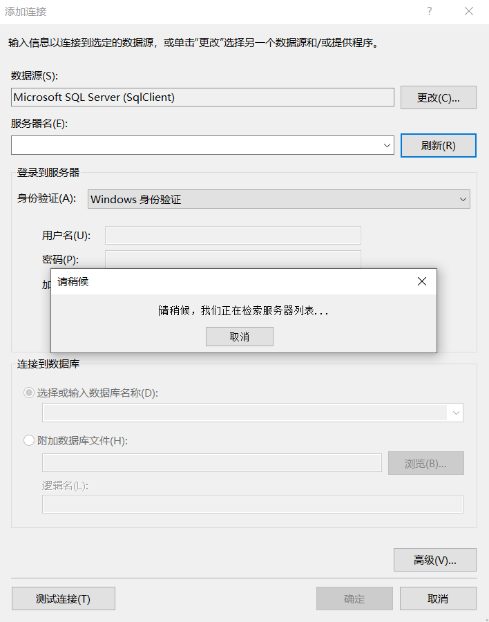
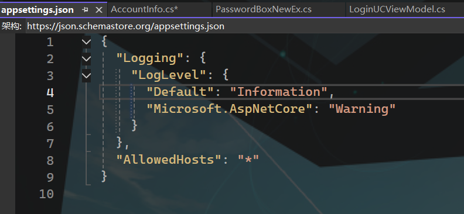

# Prism

官网：[Prism 简介 |棱镜](https://docs.prismlibrary.com/docs/)

Prism中文文档网站：[Prism 中文文档](https://coreylyn.github.io/Prism-Documentation-zh/#/)

官网的学习视频：[Prism 学习视频](https://prismlibrary.com/#learn)

博客园：[Prism开发人员指南5-WPF开发 文档翻译（纯汉语版） - o0o秋叶o0o - 博客园](https://www.cnblogs.com/DoubleChen/p/3680334.html)

## 快速开始

### [Getting Started | Prism](https://docs.prismlibrary.com/docs/platforms/wpf/getting-started.html)

Prism 入门非常简单。请按照以下步骤操作，您将快速启动并运行一个模块化且易于维护的应用程序。

> 本指南假定您对 WPF 应用程序项目的结构有一定的了解，并且对 C# 有一定的了解。了解 Model-View-ViewModel （MVVM） 模式很有帮助，而且 WPF 很容易支持该模式。如果你不是，请考虑先花点时间对它进行一些研究。

### 安装 Nuget 包

在 Visual Studio 中创建全新的 WPF 应用程序。接下来是安装相应的 nuget 包。此时，需要做出选择，即使用哪个容器来管理依赖项。就本文档而言，Unity 将是首选容器。请参阅下面的可用列表。

| 包           | 容器                                             | 版本   |
| :----------- | :----------------------------------------------- | :----- |
| Prism.Unity  | [Unity](https://github.com/unitycontainer/unity) | 5.11.1 |
| Prism.DryIoc | [DryIoc](https://github.com/dadhi/DryIoc)        | 4.0.7  |

> 注意：无需显式安装任何其他依赖项。安装上述软件包之一还将负责安装容器的软件包以及共享的 Prism 软件包。


## 各版本之间的区别


### 覆盖现有应用程序对象

入门的下一步是将新创建的 WPF 项目中包含的 Application 对象子类化。导航到 ，并将标准 WPF Application 类替换为 Prism 类。`App.xaml``PrismApplication`

```xml
<prism:PrismApplication
    x:Class="WpfApp1.App"
    xmlns="http://schemas.microsoft.com/winfx/2006/xaml/presentation"
    xmlns:x="http://schemas.microsoft.com/winfx/2006/xaml"
    xmlns:local="clr-namespace:WpfApp1"
    xmlns:prism="http://prismlibrary.com/">
    <Application.Resources>
    </Application.Resources>
</prism:PrismApplication>
```

在上面的代码段中，请注意，已添加第 6 行以定义命名空间，并且 App 对象已更新为派生自 .接下来，导航到代码隐藏文件并更新类定义。`PrismApplication``app.xaml.cs`

> 不要忘记从标签中删除该属性。否则，您最终将得到两个 window 实例。`StartupUri``PrismApplication`

```cs
using System;
using System.Collections.Generic;
using System.Configuration;
using System.Data;
using System.Linq;
using System.Threading.Tasks;
using System.Windows;
using Prism.Unity;

namespace WpfApp1
{
    public partial class App : PrismApplication
    {
    }
}
```

其中定义了一对抽象方法，必须首先实现：RegisterTypes 和 CreateShell。`PrismApplication`

#### 寄存器类型

此函数用于注册任何应用程序依赖项。例如，可能有一个接口用于从某种类型的持久存储中读取客户数据，其实现是使用某种类型的数据库。它可能看起来像这样：

```cs
public interface ICustomerStore
{
    List<string> GetAll();
}

public class DbCustomerStore : ICustomerStore
{
    public List<string> GetAll()
    {
        // return list from db
    }
}
```

应用程序中依赖于客户数据的对象（例如视图模型）将需要一个对象。在该函数中，将进行注册以在每次对象依赖 .`ICustomerStore``App.RegisterTypes``DbCustomerStore``ICustomerStore`

```cs
protected override void RegisterTypes(IContainerRegistry containerRegistry)
{
    containerRegistry.Register<Services.ICustomerStore, Services.DbCustomerStore>();
    // register other needed services here
}
```

> IContainerRegistry has other functions for registering against interfaces as well. will register a created instance of an object against an interface. In effect the implementation of the registered interface is a singleton. A similar method is that will create a single instance at the time the dependency is made and not before. It should be noted that the can also resolve concrete types without a prior registration.`RegisterInstance``RegisterSingleton``Container`

#### CreateShell

必须实现的第二种方法是 CreateShell 方法。这是将创建应用程序主窗口的方法。应该使用 App 类的 Container 属性来创建窗口，因为它会处理任何依赖项。

```cs
public partial class App : PrismApplication
{
    // RegisterTypes function is here

    protected override Window CreateShell()
    {
        var w = Container.Resolve<MainWindow>();
        return w;
    }
}
```

此时，可以构建和运行应用程序，并且应如下所示：


这现在是一个 Prism 应用程序。目前还不多，但 Prism 可以帮忙做很多事情，比如将应用程序分解成可管理的块、导航和实现 MVVM 模式。

### View 模型

WPF 可以很好地使用 MVVM 模式，而 Prism 对此有很大帮助。它有一个基类，用于处理将更改从视图模型发布到视图的 INotifyPropertyChanged 基础结构。还有一些其他类可以简化从视图模型中处理按钮的过程，而不是在代码隐藏中编写事件处理程序。

首先，需要向视图中添加一些控件。转到并添加以下标记作为 .`MainWindow.xaml``<Grid>``<MainWindow>`

```xml
<Grid>
  <Grid.RowDefinitions>
    <RowDefinition Height="*" />
    <RowDefinition Height="Auto" />
  </Grid.RowDefinitions>

  <ListView
            ItemsSource="{Binding Customers}"
            SelectedItem="{Binding SelectedCustomer}"
            />
  <Button
          Grid.Row="1" Width="80" Height="40"
          Command="{Binding CommandLoad}"
          Content="LOAD"
          />
</Grid>
```

上面将添加一个新的 listview，该视图将显示客户名称列表和用于加载列表的按钮。

> 要记住的重要一点是，每次存在 时，都会有一个指向此视图的视图模型的链接。`Binding`

为了帮助完成 Getting Started Guide 的这一部分，需要在项目中设置上面显示的服务。在项目的根目录中，创建一个文件夹。在该文件夹中，创建文件并添加以下代码：`Services``CustomerStore.cs`

```cs
public interface ICustomerStore
{
  List<string> GetAll();
}

public class DbCustomerStore : ICustomerStore
{
  public List<string> GetAll()
  {
    return new List<string>()
    {
      "cust 1",
      "cust 2",
      "cust 3",
    };
  }
}
```

在文件中，确保 包含以下行：`App.xaml.cs``RegisterTypes`

```cs
containerRegistry.Register<Services.ICustomerStore, Services.DbCustomerStore>();
```

### 创建视图模型

首先，在项目的根级别，创建一个名为 .请使用该确切名称，因为稍后在讨论视图模型解析时将需要该名称。`ViewModels`


在该文件夹内，将创建一个名为 .使用该确切名称的原因将在后面显示。Prism 有一个名为 class 的类，它用作所有视图模型的基础，并将从它派生为子类。`ViewModels``MainWindowViewModel``BindableBase``MainWindowViewModel`

```cs
using Prism.Commands;
using Prism.Mvvm;
using System;
using System.Collections.Generic;
using System.Collections.ObjectModel;
using System.Diagnostics;
using System.Linq;
using System.Text;
using System.Threading.Tasks;

namespace WpfApp1.ViewModels
{
    public class MainWindowViewModel : BindableBase
    {
        private Services.ICustomerStore _customerStore = null;

        public MainWindowViewModel(Services.ICustomerStore customerStore)
        {
            _customerStore = customerStore;
        }


        public ObservableCollection<string> Customers { get; private set; } =
            new ObservableCollection<string>();


        private string _selectedCustomer = null;
        public string SelectedCustomer
        {
            get => _selectedCustomer;
            set
            {
                if (SetProperty<string>(ref _selectedCustomer, value))
                {
                    Debug.WriteLine(_selectedCustomer ?? "no customer selected");
                }
            }
        }

        private DelegateCommand _commandLoad = null;
        public DelegateCommand CommandLoad =>
            _commandLoad ?? (_commandLoad = new DelegateCommand(CommandLoadExecute));

        private void CommandLoadExecute()
        {
            Customers.Clear();
            List<string> list = _customerStore.GetAll();
            foreach (string item in list)
                Customers.Add(item);
        }
    }
}
```

对这里发生的事情做一些解释。MainWindowViewModel 对接口具有依赖项，因此该接口必须在 中注册，以便其实现可以由依赖项容器处理。有一个属性绑定到用户界面中的 listview，还有一个属性绑定到列表视图中的当前选定项。

ICustomerStore  App.RegisterTypes  Customers  SelectedCustomer

还有实现接口的 CommandLoad 对象。这有一个方法，当用户单击按钮时调用该方法。Prism 使用允许传入委托以处理接口实现的类实现接口。在 的情况下，该函数作为委托传入，现在，每当 WPF 绑定系统尝试执行 时，都会调用 。`ICommand``Execute``ICommand``DelegateCommand``ICommand``CommandLoad``CommandLoadExecute``ICommand.Execute``CommandLoadExecute`

有关 DelegateCommand 的更多详细信息，请参阅[命令](https://docs.prismlibrary.com/docs/commands/commanding.html)。

#### 使用 ViewModelLocator

**这一段的翻译感觉有点小问题，建议看一下英文原文。**现在有了一个 View 和一个 ViewModel，但它们是如何链接在一起的呢？开箱即用的 Prism 有一个 that 使用约定来确定视图模型的正确类，使用其依赖项实例化它，并将其附加到视图。`ViewModelLocator``DataContext`

默认约定是将所有视图放置在文件夹中，并将视图模型放置在文件夹中。`Views``ViewModels`

- `WpfApp1.Views.MainWindow` => `WpfApp1.ViewModels.MainWindowViewModel`
- `WpfApp1.Views.OtherView` => `WpfApp1.ViewModels.OtherViewModel`

这是可配置的，并且可以添加不同的分辨率逻辑。

为此，View 和 ViewModel 必须正确地位于其正确的命名空间中。下面是一个屏幕截图：


[单击此处了解有关](https://docs.prismlibrary.com/docs/mvvm/viewmodel-locator.html) .`ViewModelLocator`

如果您出于某种原因不想使用此功能，则必须在视图中选择退出。您可以在 XAML 中对此进行管理，如下所示：

```xml
<Window
    ...
    xmlns:prism="http://prismlibrary.com/"
    prism:ViewModelLocator.AutoWireViewModel="False"
    >

    <!-- ui controls here -->
</Window>
```

# 龙马哥的项目实战

项目git地址：https://github.com/Jingan567/WPF_Prism_WebAPi_LongMa.git

视频地址：[【上位机系列第二阶段 WPF项目实战】WPF+prism+WebApi应用实战](https://www.bilibili.com/video/BV1sz42197wz/?p=2&share_source=copy_web&vd_source=1faf6f8be863497a8aa161f8493e14d2) 

Prism 框架提供了一套丰富的工具、类和模块，帮助开发人员实现以下功能：

1. **模块化**：Prism 框架支持将应用程序拆分为多个模块，每个模块具有自己的功能和视图。这种模块化的设计使得应用程序更加灵活和可扩展。
2. **导航**：Prism 框架提供了导航功能，可以方便地在不同的视图之间进行导航和交互。开发人员可以定义导航路径和参数，以及处理导航事件。
3. **依赖注入**：Prism 框架内置了一个轻量级的依赖注入容器，可以帮助开发人员管理和解决组件之间的依赖关系。这样可以提高代码的可测试性和可维护性。
4. **事件聚合器**：Prism 框架提供了一个事件聚合器，可以帮助不同模块之间进行解耦和通信。开发人员可以通过发布和订阅事件来实现模块之间的交互。
5. **命令绑定**：Prism 框架支持命令绑定，可以将用户操作和后台逻辑进行绑定。这样可以更好地分离用户界面和业务逻辑。
6. **可测试性**：Prism 框架的设计考虑了应用程序的可测试性，提供了一些工具和模式，帮助开发人员编写可测试的代码。

## 快速创建Wpf框架的项目

安装扩展


## **区域**


### 绑定基础

BindableBase 这是Prism中用于绑定的类，BindableBase 实现 INotifyPropertyChanged

INotifyPropertyChanged 是WPF用于绑定的接口

### 查找数据上下文

**如果文件夹是正确的，Prism可以自己找到上下文**。**通过设置prism:ViewModelLocator.AutoWireViewModel="True"，这是附加属性默认是True，可以不配置。Prism会根据命名空间去找，找到就万事大吉，找不到就GG。**不止对ViewModel的命名空间有要求，View的命名空间也有要求。

```xaml
prism:ViewModelLocator.AutoWireViewModel="True"
```

```xaml
<Window x:Class="WpfForPrism.MainWindow"
        xmlns="http://schemas.microsoft.com/winfx/2006/xaml/presentation"
        xmlns:x="http://schemas.microsoft.com/winfx/2006/xaml"
        xmlns:d="http://schemas.microsoft.com/expression/blend/2008"
        xmlns:mc="http://schemas.openxmlformats.org/markup-compatibility/2006"
        xmlns:local="clr-namespace:WpfForPrism"
        xmlns:prism="http://prismlibrary.com/" 
        prism:ViewModelLocator.AutoWireViewModel="True"
        mc:Ignorable="d"
        Title="MainWindow" Height="450" Width="800">
```

**如果不想使用Prism的自动配置，在注册类型的时候指定自己的ViewModel**

```C#
 /// <summary>
 /// 注入服务，需要什么服务就注入什么服务。
 /// </summary>
 /// <param name="containerRegistry"></param>
 protected override void RegisterTypes(IContainerRegistry containerRegistry)
 {
     containerRegistry.RegisterForNavigation<UCC,UCBViewModel>();//在注册类型的时候指定自己的ViewModel
 }
```


#### WPF中的手动配置

d:DataContext="{d:DesignInstance Type=viewmodels:MainWindow1ViewModel}" 这行代码仅用于设计时数据上下文设置，不会在运行时生效。

```xaml
 d:DataContext="{d:DesignInstance Type=viewmodels:MainWindow1ViewModel}"
```

在用户控件界面要正常使用需要

```xa
 xmlns:d="http://schemas.microsoft.com/expression/blend/2008"
 xmlns:mc="http://schemas.openxmlformats.org/markup-compatibility/2006"
 mc:Ignorable="d"
 d:DataContext="{d:DesignInstance Type=viewmodels:LoginUCViewModel}"
```


这样写就可以让配置在运行时也生效

```xaml
<Window d:DataContext="{d:DesignInstance Type=viewmodels:MainWindow1ViewModel}"
        DataContext="{Binding Source={x:Static viewmodels:MainWindow1ViewModel}}">
  <Window.Resources>
    <viewmodels:MainWindow1ViewModel x:Key="MainWindow1ViewModel"/>
  </Window.Resources>
</Window>
```

### 依赖注入


将需要的类型注入到容器中，需要使用的时候使用

```C#
_regionManager.Regions["contentRegion"].RequestNavigate(viewName);
```

### 设置区域名称

```xaml
 <ContentControl Grid.Row="1" prism:RegionManager.RegionName="contentRegion" />
 <!-- prism:RegionManager.RegionName="contentRegion" 指定一个区域的名称-->
```

```C#
protected override void RegisterTypes(IContainerRegistry containerRegistry)
{
    containerRegistry.RegisterForNavigation<UCC>("C");//C是指定的名称
}
```


## 模块化

**我要引用的模块不在我这个项目里面，在其他的项目里面。**我不想引用，因为引用需要生成。模块化就是要实现这个功能

**去除引用，新建Modules文件夹，将模块.dll放入其中。**


将dll选择始终复制，生成操作还是无


Debug的目录下就多了一个Modules文件夹，这样应该可以直接将写好的模块直接丢到这个文件夹中。**这个dll只用在使用的时候才去加载。比直接在项目中引用更快一点。**


## 导航

### NavigationParameters类

这是一个字典。

### DialogParameters类

对话框参数，也是一个字典。

### INavigationAware接口

```C#
 public interface INavigationAware : IRegionAware
 {
 }

 public interface IRegionAware
 {
     /// <summary>
     /// Called when the implementer has been navigated to.
     /// </summary>
     /// <param name="navigationContext">The navigation context.</param>
     void OnNavigatedTo(NavigationContext navigationContext);

     /// <summary>
     /// Called to determine if this instance can handle the navigation request.
     /// </summary>
     /// <param name="navigationContext">The navigation context.</param>
     /// <returns>
     /// <see langword="true"/> if this instance accepts the navigation request; otherwise, <see langword="false"/>.
     /// </returns>
     bool IsNavigationTarget(NavigationContext navigationContext);

     /// <summary>
     /// Called when the implementer is being navigated away from.
     /// </summary>
     /// <param name="navigationContext">The navigation context.</param>
     void OnNavigatedFrom(NavigationContext navigationContext);
 }
```

Aware是光纤，线缆的意思。接口需要实现下面三个方法。

```C#
/// <summary>
/// 是否重用实例
/// </summary>
/// <param name="navigationContext"></param>
/// <returns></returns>
/// <exception cref="NotImplementedException"></exception>
public bool IsNavigationTarget(NavigationContext navigationContext)
{
    return true;
}

/// <summary>
/// 导航离开之后，触发
/// </summary>
/// <param name="navigationContext"></param>
/// <exception cref="NotImplementedException"></exception>
public void OnNavigatedFrom(NavigationContext navigationContext)
{
    
}

/// <summary>
/// 导航已经过来，接收参数，To在From后面
/// </summary>
/// <param name="navigationContext"></param>
/// <exception cref="NotImplementedException"></exception>
public void OnNavigatedTo(NavigationContext navigationContext)
{
    if (navigationContext.Parameters.ContainsKey("MsgA"))
        Msg = navigationContext.Parameters.GetValue<string>("MsgA");
}
```

在模块下添加对应的pdb文件之后，可以调试。


### IConfirmNavigationRequest接口

```C#
/// <summary>
/// Provides a way for objects involved in navigation to determine if a navigation request should continue.
/// </summary>
public interface IConfirmNavigationRequest : IRegionAware
{
    /// <summary>
    /// Determines whether this instance accepts being navigated away from.
    /// </summary>
    /// <param name="navigationContext">The navigation context.</param>
    /// <param name="continuationCallback">The callback to indicate when navigation can proceed.</param>
    /// <remarks>
    /// Implementors of this method do not need to invoke the callback before this method is completed,
    /// but they must ensure the callback is eventually invoked.
    /// </remarks>
    void ConfirmNavigationRequest(NavigationContext navigationContext, Action<bool> continuationCallback);
}
```

比上面的**INavigationAware接口**就多一个**ConfirmNavigationRequest方法**需要实现。

Tips：**可能写在Module里面的才需要实现这个接口。要不就是这两个接口是你需要对导航功能定制的时候才需要**

将下面这两句写上，UI上就会有提示。不至于每一个都要去后台复制。

```xaml
xmlns:vm ="clr-namespace:WpfForPrism.ViewModels"
d:DataContext="{d:DesignInstance vm:MainWindow3_模块ViewModel}"
```

### IRegionNavigationJournal类

Journal是记录的意思。主要使用这个导航的上下文和GoBack方法去切换页面

切换页面的回调里面记录上下文

```c#
 private void ShowCmd_Executed(string viewName)
 {
     NavigationParameters paras = new NavigationParameters();//这是一个字典
     paras.Add("MsgA", "大家好，我是A");
     _regionManager.Regions["contentRegion"].RequestNavigate(viewName, CallBack =>
     {
         _journal = CallBack.Context?.NavigationService.Journal;
         //Context这里的上下文可能是空的。
     }, paras);
 }
```

### NavigationContext类

看着像是导航上下文，在导航页面之间传递参数使用的。

###  IDialogService类

对话框服务类，也是通过构造函数注入，不清楚是Prism提供还是怎么说。

### IDialogAware接口

需要实现的方法，一般放在ViewModel类上继承。

```c#
 public DialogCloseListener RequestClose=>throw new NotImplementedException();

 /// <summary>
 /// 是否能够关闭对话框
 /// </summary>
 /// <returns></returns>
 public bool CanCloseDialog()
 {
     return true;
 }

 /// <summary>
 /// 关闭，需要处理的事情
 /// </summary>
 public void OnDialogClosed()
 {
     
 }

 /// <summary>
 /// 打开对话框
 /// </summary>
 /// <param name="parameters"></param>
 public void OnDialogOpened(IDialogParameters parameters)
 {
     
 }
```

**导航**切换**传参**流程图


导航可以不实现INavigationAware接口，默认页面是重用的。配置完这个之后，就每次都是一个新对象，对页面的操作消失。

```c#
 public class ViewBViewModel : BindableBase, INavigationAware
 {
     public ViewBViewModel()
     {

     }

     public bool IsNavigationTarget(NavigationContext navigationContext)
     {
         return false;//配置完这个之后，就每次都是一个新对象，对页面的操作消失。默认是重用的！！！
     }

     public void OnNavigatedFrom(NavigationContext navigationContext)
     {

     }

     public void OnNavigatedTo(NavigationContext navigationContext)
     {

     }
 }
```

### WPF中不太好处理的业务——对话框

黄色的部分需要将页面的处理结果给返回过来，WPF不太好处理，需要自己定义对应的委托或者事件


疑问：

1. 怎么设置用户控件的DataContext引用？
2. 导航没有Title到底是怎么绑定上的。

**对话框页面——允许关闭**


```骚话
哑铃累了可以放下，但砖头不能
```

#### 部分代码

打开对话框，主页面ViewModel

```c#
private void ShowDialogCmd_Action(string viewName)
{
    DialogParameters paras = new DialogParameters();
    paras.Add("Title", "动态传递的标题");
    paras.Add("para1", "参数值1");
    paras.Add("para2", "参数值2");
    _dialogService.ShowDialog(viewName, paras, callback =>
    {
        if (callback.Result == ButtonResult.OK)
        {
            string para1 = callback.Parameters.GetValue<string>("para1");
        }
    });
}
```

对话框页面

```xaml
<UserControl
    x:Class="MoudleA.Views.ViewC"
    xmlns="http://schemas.microsoft.com/winfx/2006/xaml/presentation"
    xmlns:x="http://schemas.microsoft.com/winfx/2006/xaml"
    xmlns:prism="http://prismlibrary.com/"
    xmlns:viewmodels="clr-namespace:MoudleA.ViewModels"
    Width="400"
    Height="200"
    prism:ViewModelLocator.AutoWireViewModel="True">
    <Grid>
        <Grid.RowDefinitions>
            <RowDefinition Height="auto" />
            <RowDefinition />
            <RowDefinition Height="auto" />
        </Grid.RowDefinitions>
        <TextBlock Text="{Binding Title}" />
        <TextBlock
            Grid.Row="1"
            FontSize="30"
            Text="大家好" />
        <StackPanel Grid.Row="2" Orientation="Horizontal">
            <Button Command="{Binding Comfirm}" Content="确定" />
            <Button Command="{Binding Quit}" Content="取消" />
        </StackPanel>
    </Grid>
</UserControl>
```


对话框ViewModel

```c#
 public class ViewCViewModel : BindableBase, IDialogAware
 {
     public DelegateCommand Comfirm {  get; set; }
     public DelegateCommand Quit {  get; set; }

     public ViewCViewModel()
     {
         //RequestClose = new DialogCloseListener();//我自己在这里new了一个，这里不new也会在容器里面通过反射被注入对象
         Comfirm = new DelegateCommand(Confirm_Action);
         Quit = new DelegateCommand(Quit_Action);
     }

     private void Quit_Action()
     {
         RequestClose.Invoke(ButtonResult.No);//这个传完参数，会关闭兑换框
     }

     private void Confirm_Action()
     {
         DialogParameters parameters = new DialogParameters();
         parameters.Add("张三", 100);
         parameters.Add("黎诗", 100);
         RequestClose.Invoke(parameters, ButtonResult.Yes);
     }

     private string _title = "这是对话框的标题";//
     /// <summary>
     /// 这个在哪里绑定到对话框标题上，没看出来。
     /// 之前接口里面有这个属性，现在接口里面也没有啊
     /// 并且这个名字还不能更改，否则就不显示了
     /// </summary>
     public string Title
     {
         get
         {
             return _title;
         }
         set
         {
             if (_title != value)
             {
                 _title = value;
                 RaisePropertyChanged(nameof(Title));//属性更改通知界面
                 //SetProperty(ref _title, value,nameof(Title));// 触发属性变更通知,这个简单测试一下好像没反应
             }
         }
     }

     /// <summary>
     /// 这个事件一旦触发会执行关闭流程，无论传入的参数是什么。先执行CanCloseDialog => OnDialogClosed
     /// 这个将事件public event Action<IDialogResult> RequestClose包装了一下
     /// </summary>
     public DialogCloseListener RequestClose { get; }
     /// <summary>
     /// 自己定义一个关闭窗体的信号变量
     /// </summary>
     private bool _canCloseDialog = true;

     /// <summary>
     /// 是否能够关闭对话框
     /// </summary>
     /// <returns></returns>
     public bool CanCloseDialog()
     {
         //return true;
         //return false;//页面关闭按钮还在，只是不能关闭页面了

         return _canCloseDialog;//天才和蠢材只在一念之间
         #region 蠢材写法
         //if (_canCloseDialog)
         //{
         //    return true;
         //}
         //else
         //{
         //    return false;
         //}
         #endregion
     }

     /// <summary>
     /// 关闭，需要处理的事情
     /// 所有触发关闭关闭都走这个事件，可以传递参数
     /// </summary>
     public void OnDialogClosed()
     {
         DialogParameters parameters = new DialogParameters();
         parameters.Add("张三", 100);
         parameters.Add("黎诗", 100);
         RequestClose.Invoke(parameters, ButtonResult.OK);
     }

     /// <summary>
     /// 打开对话框
     /// </summary>
     /// <param name="parameters"></param>
     public void OnDialogOpened(IDialogParameters parameters)
     {
         Title = parameters.GetValue<string>("Title");
         string p1 = parameters.GetValue<string>("para1");
         string p2 = parameters.GetValue<string>("para2");
     }
 }
```

## 发布订阅

```c#
        /// <summary>
        /// 发布
        /// </summary>
        /// <param name="sender"></param>
        /// <param name="e"></param>
        private void BtnPubClick(object sender, RoutedEventArgs e)
        {
            EventAggregator.GetEvent<MsgEvent>().Publish("Hello, 我想出去旅游！");
        }

        /// <summary>
        /// 订阅
        /// </summary>
        /// <param name="sender"></param>
        /// <param name="e"></param>
        private void BtnSubClick(object sender, RoutedEventArgs e)
        {
            EventAggregator.GetEvent<MsgEvent>().Subscribe(MsgEvent_Action);
        }

        private void MsgEvent_Action(string obj)
        {
            MessageBox.Show($"我收到的订阅消息：{obj.ToString()}");//这里应该不会阻塞，但是看执行的时候还是有先后
        }

        /// <summary>
        /// 取消订阅
        /// </summary>
        /// <param name="sender"></param>
        /// <param name="e"></param>
        private void BtnCancelSubClick(object sender, RoutedEventArgs e)
        {
            EventAggregator.GetEvent<MsgEvent>().Unsubscribe(MsgEvent_Action);
        }
```

## WebApi

### **1. 什么是REST**

REST（Representational State Transfer，表述性状态传递）是 Roy Fielding 博士在 2000 年他的博士论文中提出的一种软件架构风格，作为一种 Web 服务的设计与开发方式，REST 可以降低开发的复杂性，提高系统的可伸缩性。

REST 是一种基于资源的架构风格。在 REST 中，资源（Resource）是最基本的概念，任何能够命名的对象都是资源，如：user、tome、order、document。它表示 Web 服务要操作的一个实体。**一个资源具有一个统一资源标识符（Uniform Resource Identifier，URI）**，如 `users/123`。通过资源能够标识并访问资源。

------

### **2. 什么是API**

API 全称 Application Programming Interface，即应用程序编程接口，我们在开发应用程序时经常用到。**API 作为接口，用来“连接”两个不同的系统，并使其中一方为另一方提供服务。比如在操作系统上运行的应用程序能够访问操作系统所提供的 API，并通过这些 API 来调用操作系统的各种功能。**

因此，API 是一个系统向外暴露或公开的一套接口，通过这些接口，外部应用程序能够访问该系统。在 Web 应用程序中，Web API 具有同样的特性，它作为一个 Web 应用程序，向外提供了一些接口，这些接口的功能通常是对数据进行操作（如获取或修改数据等）。它们能够被外部应用程序，比如桌面应用程序、手机应用甚至其他 Web 应用程序（如 ASP.NET Core MVC 应用、单页 Web 应用）等访问并调用。Web API 能够实现不同应用程序之间的访问，它与平台或编程语言无关。可以使用不同的技术来构建WebApi，如Java、NET等。

**总结：Rest是一种架构风格，Api是技术实现。**

------

### **3. 什么是HTTP协议**

HTTP（HyperText Transfer Protocol，超文本传输协议）是一种用于传输超文本的应用层协议。以下是HTTP协议的核心内容：


1. **URL统一资源定义符**
   URL（Uniform Resource Locator）用于标识互联网上的资源位置。

2. **媒体类型（Content Type）**
   媒体类型，也称为内容类型（Content Type），用于描述传输数据的格式，例如 `text/html`、`application/json` 等。

3. **HTTP消息**
   HTTP消息是HTTP协议中客户端与服务器之间交互的语言，由以下部分组成：

   - **3.1 起至行**：包含请求方法、URL和协议版本（如 `GET /index.html HTTP/1.1`）。
   - **3.2 HTTP消息头**：描述消息体的内容及相关配置，例如 `Content-Type`、`Content-Length` 等。
   - **3.3 空行**：用于分隔消息头和消息体。
   - **3.4 消息体**：包含实际传输的数据（如表单数据、JSON等）。

4. **HTTP方法**

   HTTP协议定义了多种方法用于操作资源，常见方法包括：

   - **GET**：获取资源。
   - **POST**：创建资源。
   - **PUT**：更新资源。
   - **DELETE**：删除资源。
   - **PATCH**：部分更新资源。
   - **HEAD**：获取资源的元数据。
   - **OPTIONS**：获取服务器支持的HTTP方法。

5. **HTTP消息头**

   - **HTTP请求头**
   - **HTTP响应头**

6. **状态码**

   - **1XX**：信息
   - **2XX**：成功
   - **3XX**：重定向
   - **4XX**：客户端错误
   - **5XX**：服务端错误

### 路由规则

1、这个只访问到控制器

http://......api/[controller]

2、这个往下面访问到动作

http://......api/[controller]/[action]

#### 代码示例

访问到动作

```c#
 /// <summary>
 /// Route 路由
 /// </summary>
 [Route("api/[controller]/[action]")]//推荐小写，大写也没关系
 [ApiController]
 public class StudyController : ControllerBase
 {
     [HttpGet]
     public IActionResult Func1()
     {
         return Ok("龙马哥");
     }
     [HttpGet]
     public IActionResult Func2()
     {
         return Ok("龙马哥");
     }
 }
```

#### 标记两个路由

```c#
/// <summary>
/// Route 路由
/// </summary>
[Route("api/[controller]/[action]")]//推荐小写，大写也没关系
[Route("apitest/[controller]/[action]")]
[ApiController]
public class StudyController : ControllerBase
{
    [HttpGet]//Get方法获取一个值
    public IActionResult Func1()
    {
        return Ok("龙马哥");
    }
    [HttpPost]
    public IActionResult Func2()
    {
        return Ok("龙马哥");
    }
}
```

这个控制器下的每一个动作都会变成两个


动作上标记两个路由

```C#
 [HttpGet("F1")]
 [HttpGet]
 //默认路由
 //Get方法获取一个值
 public IActionResult Func1()
 {
     return Ok("龙马哥");
 }
```

这里会有两个动作


#### ASP.NET Core 按以下优先级匹配路由：

1. **精确路由模板**（如 `[HttpGet("Func1/{name}")]`）。
2. **参数化路由**（如 `[HttpGet("Func1")]` 与 `[HttpGet("Func1/{name}")]`）。
3. **默认约定路由**（如 `[HttpGet]` 无模板）。

### 端口号配置位置


配置文件

```json
{
  "$schema": "http://json.schemastore.org/launchsettings.json",
  "iisSettings": {
    "windowsAuthentication": false,
    "anonymousAuthentication": true,
    "iisExpress": {
      "applicationUrl": "http://localhost:62804",
      "sslPort": 44378
    }
  },
  "profiles": {
    "http": {
      "commandName": "Project",
      "dotnetRunMessages": true,
      "launchBrowser": true,
      "launchUrl": "swagger",
      "applicationUrl": "http://localhost:5159",
      "environmentVariables": {
        "ASPNETCORE_ENVIRONMENT": "Development"
      }
    },
    "https": {
      "commandName": "Project",
      "dotnetRunMessages": true,
      "launchBrowser": true,
      "launchUrl": "swagger",
      "applicationUrl": "https://localhost:7220;http://localhost:5159",
      "environmentVariables": {
        "ASPNETCORE_ENVIRONMENT": "Development"
      }
    },
    "IIS Express": {
      "commandName": "IISExpress",
      "launchBrowser": true,
      "launchUrl": "swagger",
      "environmentVariables": {
        "ASPNETCORE_ENVIRONMENT": "Development"
      }
    }
  }
}
```

### 启用Swagger


Swagger提供了一个快速测试和方便查看的Api文档

#### 添加注释映射到Api文档

1、在代码上添加功能注释和参数注释

```c#
/// <summary>
/// 功能一 返回学生的姓名
/// </summary>
/// <param name="name">传入姓名</param>
/// <returns>返回学生的姓名</returns>
[HttpGet("{name}")]
public IActionResult Func1(string name)
{
    return Ok(name);
}
```

2、项目属性 => 生成 => 输出 => 文档文件（勾选）


修改Program.cs中的代码，让文档显示出来

```c#
builder.Services.AddSwaggerGen(m =>
{
    string path = AppContext.BaseDirectory + "Study.Api.xml";
    //AppContext.BaseDirectory
    //1、获取程序集冲突解决程序用于探测程序集的基目录的文件路径。
    //2、这是每个应用程序域的属性。它的值对应于当前应用程序域的 AppDomain.BaseDirectory 属性。
    m.IncludeXmlComments(path,true);//引入Xml,并显示出来
});
```


### Api的应用场景

同一公司


不是同一个公司（BToB）


## SQLServer数据库

### 问题

#### 服务器名找不到的情况

可以直接复制服务器名



#### 连接自身

1. 自身服务器名
2. 或者.


### Microsoft SQL Server 数据库文件 (SqlClient)


这个像是直接创建了一个本地数据库文件


#### 连接字符串

```sql
Data Source=(LocalDB)\MSSQLLocalDB;AttachDbFilename=C:\Users\30813\Documents\TestLC.mdf;Integrated Security=True;Connect Timeout=30
```

### Microsoft SQL Server (SqlClient)


#### 连接字符串

```sql
Data Source=冬月十六的幻16;Initial Catalog=master;User ID=sa;Password=***********;Trust Server Certificate=True
```

## 项目实战

项目架构图


中间数据使用Json


## SVG图像处理

### 1、使用软件去转

[Inkscape - Draw Freely. | Inkscape](https://inkscape.org/)

### 2、直接在程序中使用

可能不适用于多个Path的情况

```xaml
<Viewbox Width="200" Height="200">
    <Path Data="M 925.072 866.338 c -22.55 -58.665 -54.879 -111.396 -96.079 -156.727 c -41.419 -45.572 -89.732 -81.389 -143.598 -106.458 a 428.81 428.81 0 0 0 -31.037 -12.991 c 23.153 -13.107 44.673 -29.438 63.998 -48.763 c 56.076 -56.076 86.959 -130.633 86.959 -209.936 s -30.881 -153.86 -86.959 -209.936 s -130.634 -86.959 -209.937 -86.959 s -153.86 30.883 -209.937 86.959 c -56.076 56.078 -86.959 130.633 -86.959 209.936 s 30.883 153.86 86.959 209.936 c 19.325 19.325 40.846 35.655 63.997 48.763 a 429.898 429.898 0 0 0 -31.037 12.991 c -53.866 25.068 -102.179 60.884 -143.598 106.458 c -41.202 45.332 -75.248 97.431 -96.08 156.727 c -17.385 49.481 -15.568 98.351 -16.45 121.174 h 69.838 C 142.848 824.515 297.84 633.689 508.42 633.689 c 210.579 0 369.644 197.809 370.256 353.823 h 69.837 c -1.243 -44.114 -0.159 -60.62 -23.438 -121.174 Z M 281.379 331.462 c 0 -125.188 101.85 -227.038 227.039 -227.038 c 125.188 0 227.039 101.85 227.039 227.038 S 633.606 558.5 508.418 558.5 c -125.189 0 -227.039 -101.85 -227.039 -227.038 Z" Fill="#8a8a8a" />
</Viewbox>
<Viewbox Width="10" Height="10">
    <Path Data="M512.005165 64.047998c86.515674 0 145.272736 29.438528 174.59127 87.499625 24.502775 48.557572 24.502775 107.242638 24.502775 158.99205 0 67.116644-33.878306 147.272636-93.019349 219.861007l-37.502125 46.093695 43.189841 40.837958c19.567022 18.439078 62.012899 41.253937 138.649068 79.564022 71.764412 35.870206 120.577971 61.148943 143.896805 84.491775 41.101945 41.093945 53.069347 117.9941 53.629319 156.960152 0.095995 5.687716-2.127894 11.247438-6.095695 15.279236-4.063797 4.135793-9.471526 6.383681-15.215239 6.383681L85.330498 960.011199c-5.663717 0-11.223439-2.311884-15.19124-6.383681-3.967802-4.031798-6.19969-9.59152-6.143693-15.247238 0.183991-10.743463 3.143843-106.466677 53.629319-156.99215 23.318834-23.310834 72.140393-48.549573 143.896805-84.491775 76.60417-38.246088 119.082046-61.100945 138.649068-79.628019l43.189841-40.813959-37.502125-46.061697c-59.069047-72.556372-92.987351-152.712364-92.987351-219.861007 0-51.749413 0-110.434478 24.502775-158.99205C366.732428 93.486526 425.433493 64.047998 512.005165 64.047998M512.005165 0.051197C371.644183 0.051197 308.511339 66.735863 280.280751 122.709065c-31.382431 62.148893-31.382431 131.833408-31.382431 187.830608 0 82.555872 39.382031 176.79916 107.330633 260.266987-16.255187 15.351232-83.139843 48.789561-123.329834 68.836558-79.700015 39.870006-130.273486 66.244688-160.511974 96.499175-66.964652 66.956652-72.028399 179.359032-72.356382 201.229939-0.375981 22.822859 8.455577 44.869757 24.502775 61.188941 16.031198 16.239188 37.942103 25.430728 60.79696 25.430728l853.309335 0c22.870856 0 44.757762-9.183541 60.788961-25.430728 16.039198-16.319184 24.878756-38.374081 24.534773-61.220939-0.343983-21.838908-5.439728-134.241288-72.388381-201.19794-30.19049-30.254487-80.79596-56.629169-160.519974-96.499175-40.189991-20.054997-107.082646-53.493325-123.305835-68.836558 67.916604-83.467827 107.330633-177.711114 107.330633-260.266987 0-55.9972 0-125.681716-31.350432-187.830608C715.482991 66.735863 652.342148 0.051197 512.005165 0.051197L512.005165 0.051197z" Fill="#272636" />
</Viewbox>
```

## EF框架

### 什么是EF


EF（Entity Framework）是微软提供的**ORM（Object Relational Mapping，对象关系映射）**工具，支持面向对象的软件应用程序开发。主要特性包括：

- 帮助开发人员减少数据库访问代码编写时间
- 提供变更跟踪、唯一性约束、延迟加载、事务支持等功能
- 允许使用LINQ语言进行数据库操作
- 使开发者能更专注于业务逻辑层代码

#### 加载

```c#
public DbSet<AccountInfo> AccountInfos { get; set; }
```

#### 延迟加载(惰性/懒汉加载)

```c#
public virtual DbSet<AccountInfo> AccountInfos { get; set; }
```

### EF三种模式

1. ### DBFirst（数据库优先）：

   - 基于现有数据库生成实体类
   - 适用于已有数据库结构的场景

2. ### **CodeFirst（代码优先）**：

   - 通过实体类生成数据库表结构
   - 支持领域驱动设计（DDD）开发模式

3. **ModelFirst（模型优先）**：

   - 使用可视化设计器构建数据模型
   - 同步生成数据库结构和实体类
   - 适合通过图形化界面设计数据库

### 数据库连接字符串

- 可以写死
- 也可写配置

#### 配置写法

将配置的连接字符串写在appsettings.json中

```json
{
  "Logging": {
    "LogLevel": {
      "Default": "Information",
      "Microsoft.AspNetCore": "Warning"
    }
  },
  "AllowedHosts": "*",
  "ConnectionStrings": {
    "Constr": "server=.;uid=sa;pwd=123456;database=DailyApp;Encrypt=True;TrustServerCertificate=true"
  }
}
```

配好架构 https://json.schemastore.org/appsettings.json 有智能提示

#### 字符串含义

```c#
server=数据库地址及实例;uid=数据库账号;pwd=数据库密码;database=数据库名;Encrypt=True;TrustServerCertificate=true
```

##### Encrypt——是否对客户端与服务端之间的通信启用加密。

###### 常见取值及含义

**Encrypt=True**

- 含义：强制启用加密（如 TLS/SSL）。
- 场景：生产环境，需确保数据传输安全。
- 要求：服务端必须提供有效证书，否则连接失败。

**Encrypt=False**

- 含义：禁用加密，数据以明文传输。

- 风险：易被中间人攻击窃取敏感信息，仅限测试环境使用。

**Encrypt=Strict**（部分框架支持）

- 含义：强制加密，且验证证书完整性和颁发机构（CA）。
- 安全级别：最高，适用于金融、医疗等敏感领域。

##### TrustServerCertificate

联合使用示例：

```string
Encrypt=True;TrustServerCertificate=False;  // 严格模式（需有效证书）
Encrypt=True;TrustServerCertificate=True;   // 加密但跳过证书验证（开发环境）
Encrypt=False;                               // 不加密（仅测试）
```

**TrustServerCertificate=True**

- 作用：客户端不验证服务端证书的有效性（即使证书自签名或过期）。
- 风险：可能存在中间人攻击，但便于开发调试。
- 适用场景：本地开发、内部测试环境（非生产）。

### 数据上下文

注入数据上下文

```c#
//注入数据库上下文
builder.Services.AddDbContext<DailyDbContext>(m =>
{
    m.UseSqlServer(builder.Configuration.GetConnectionString("Constr"));
});

```

### 数据迁移

需要 Microsoft.EntityFrameworkCore.Tools 这个库去迁移，迁移文件文件夹Migrations

Migrations——迁移

#### 命令

程序包管理器使用命令

##### 1、创建迁移（这个时候已经连上数据库）

```cmd
add-migration longma0229 #创建迁移，命令不区分大小写，迁移文件名字longma0229
```

##### 2、遇到SSL连接问题，需要重新生成迁移

```cmd
Add-Migration Longma0229 -Verbose
```


###### 删除迁移文件

```cmd
Remove-Migration#大小写没区别，删除最近一次未应用到数据库的迁移文件
```

也可以直接在文件夹下删除迁移文件


###### 如果迁移未应用到数据库

- 直接删除迁移文件夹中的 `longma0229` 迁移文件（包括 `.cs` 和 `.Designer.cs`）。
- 清理项目并重新生成，确保无残留编译错误。

###### 如果已经更新到数据库，需要回滚

```cmd
# 回滚到上一个迁移版本
Update-Database -Migration <上一个迁移名称>

# 删除当前迁移
Remove-Migration
```

##### 3、更新数据库

```cmd
Update-Database
```


### appsettings.json文件智能提示

配置架构：https://json.schemastore.org/appsettings.json



## DTO——数据传输对象


